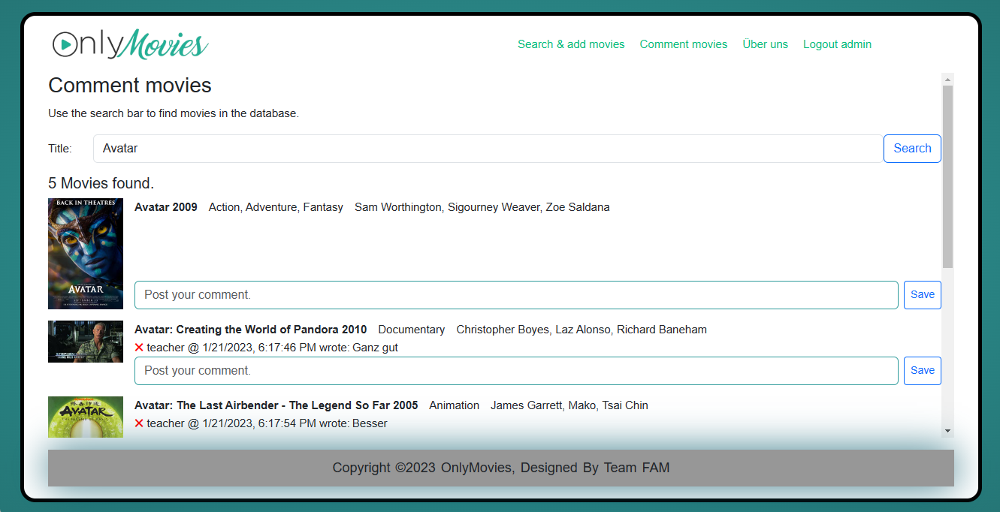
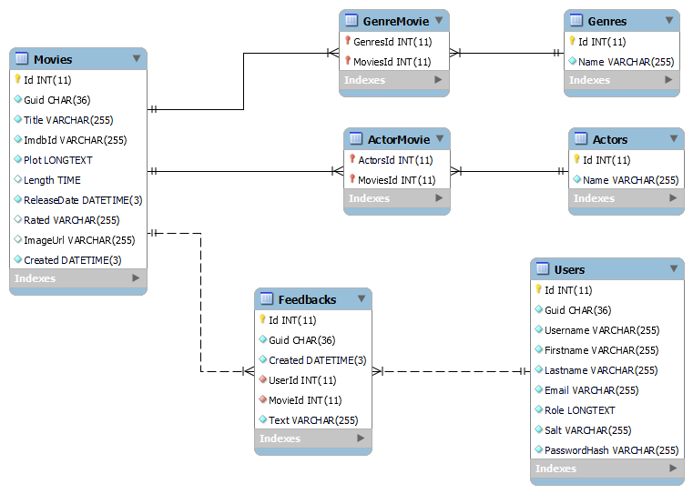

# Only Movies

Klone das Repository mit folgendem Befehl:

```
git clone https://github.com/Aminjo1204/Only_Movies
```

## Kurzbeschreibung



OnlyMovies oder auch OM ist eine Webapplikation, die dem Benutzer wichtige Daten bzw. Blogposts aus der Kinowelt zur Verfügung stellt. Der User kann die OMDb API durchsuchen, um Filme hinzuzufügen. Diese Filme können dann von anderen Usern kommentiert werden.

Administratoren können Kommentare löschen, falls etwas Unpassendes gepostet wurde.

## Teammitglieder

| Name                   | Email                    | Aufgabenbereich |
| ---------------------- | ------------------------ | --------------- |
| Bajramovic Amin, 3CHIF | BAJ20217@spengergasse.at |                 |
| Gutic Filip, 3CHIF     | GUT20264@spengergasse.at |                 |
| Kahric Muhammed, 3CHIF | KAH20283@spengergasse.at |                 |

## Voraussetzungen

Das Projekt verwendet .NET in der Version >= 6. Prüfe mit folgendem Befehl, ob die .NET SDK in der
Version 6 oder 7 am Rechner installiert ist:

```
dotnet --version
```

Die .NET 6 SDK (LTS Version) kann von https://dotnet.microsoft.com/en-us/download/dotnet/6.0 für alle
Plattformen geladen werden.

Zum Prüfen der Docker Installation kann der folgende Befehl verwendet werden. Er muss die Version
zurückgeben:

```
docker --version
```

Im Startskript wird der Container geladen, bevor der Server gestartet wird.

## Starten des Programmes

Führe nach dem Klonen im Terminal den folgenden Befehl aus, um den Server zu starten.

**Windows**

```
startServer.cmd
```

**macOS, Linux**

```
chmod a+x startServer.sh
./startServer.sh
```

Nach dem Starten des Servers kann im Browser die Seite **http://localhost:5000**
aufgerufen werden. Falls die Meldung erscheint, dass das Zertifikat nicht geprüft werden kann,
muss mit *Fortsetzen* bestätigt werden.

## Datenmodell

Das Programm erzeugt eine mariaDB Datenbank mit folgendem physischem Schema.



## Use Case

Hier das Use-Case Diagramm zu dem veröffentlichten eines Kommentares bzw. Blogs


